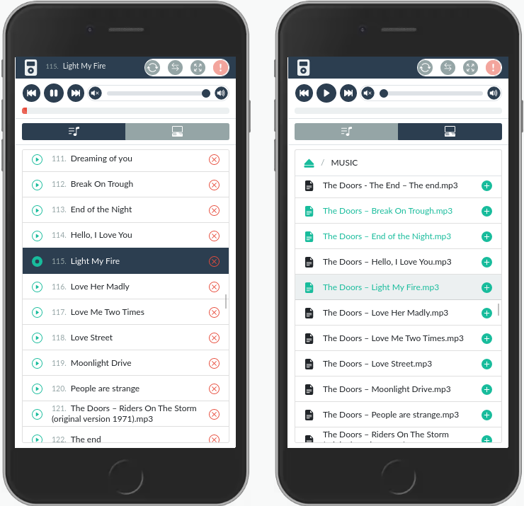
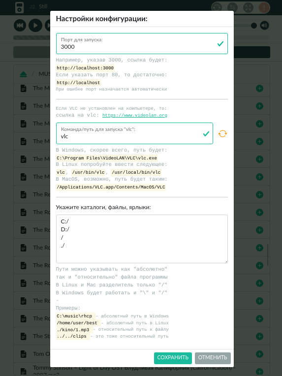

# remote-media-control
Web-интерфейс для плеера VLC



## Как использовать:
1. Необходимо установить плеер [VLC](https://www.videolan.org)
2. Скачать сборку программы для нужной операционной системы:
   - Для Windows x64: [remote-media-control-win.exe](https://raw.githubusercontent.com.com/wareset/remote-media-control/main/pkg/remote-media-control-win.exe)
   - Для Linux x64: [remote-media-control-linux](https://raw.githubusercontent.com.com/wareset/remote-media-control/main/pkg/remote-media-control-linux)
   - Для Mac x64: [remote-media-control-macos](https://raw.githubusercontent.com.com/wareset/remote-media-control/main/pkg/remote-media-control-macos)


Для Mac и Linux, возможно, придется выполнить следующую команду перед запуском:
```bash
# Замените /path/to на директорию со скачанной программой
chmod +x /path/to/remote-media-control-macos 
```

3. Запустить скачанную программу. Двойной клик тоже сработает, но лучше запускать через терминал (в Windows - cmd.exe) так:
```bash
# Замените /path/to на директорию со скачанной программой
"./path/to/remote-media-control-linux"
```
При запуске через терминал будет видна небольшая справочная информация и будут понятно, что программа работает.

4. После запуска окроется вкладка браузера с запущенным web-интерфейсом, по адресу "http://localhost:3000" (если порт 3000 занят, будет выбран другой порт) и появится страница предварительной настройки:



Если вкладка не открылалсь, нужно будет открыть ее самостоятельно. Поэтому лучше открывать программу через терминал, т.к. там будет написан порт.

## Для разработки:

Нужно склонировать репозиторий и установить зависимости:
```bash
git clone https://github.com/wareset/remote-media-control.git
cd remote-media-control
npm install
```

Запуск в dev-режиме, чтобы вносить изменения и сразу видеть результат:
```bash
npm run dev
```

Запуск build, чтобы собрать проект и создать pkg-файлы:
```bash
npm dun build
```

## License
[MIT](LICENSE)